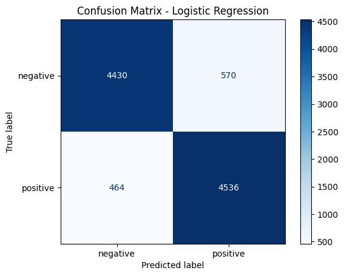
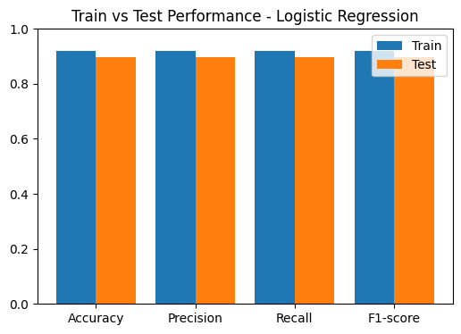
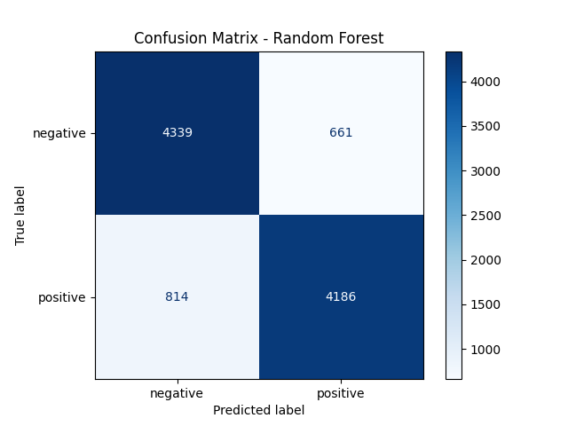
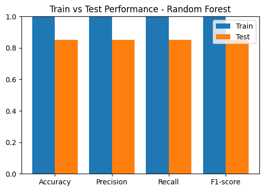
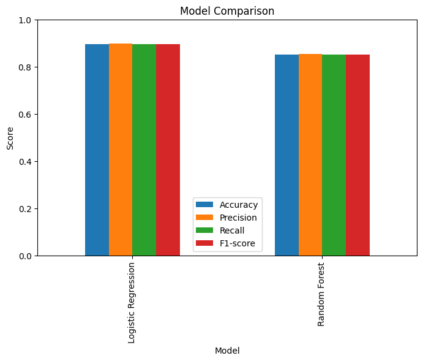

# Sentiment Analysis on Movie Reviews

## 📖 Project Overview
This project performs **sentiment analysis** on a dataset of 50,000 movie reviews.  
The goal is to classify reviews as **positive** or **negative** using machine learning models.

---

## ⚙️ Approach
1. **Dataset**: 50,000 text reviews with sentiment labels (`positive`, `negative`).
2. **Preprocessing**:
   - Text cleaned and converted into numerical features using **TF-IDF Vectorizer** (`max_features=10000`).
   - Dataset split into 80% training and 20% testing.
3. **Models Trained**:
   - Logistic Regression
   - Random Forest
4. **Evaluation Metrics**:
   - Accuracy
   - Precision
   - Recall
   - F1-score

---

## 📊 Results

| Model               | Accuracy | Precision | Recall | F1-score |
|----------------------|----------|-----------|--------|----------|
| Logistic Regression  | **0.8966** | **0.8968** | **0.8966** | **0.8966** |
| Random Forest        | 0.8525   | 0.8528    | 0.8525 | 0.8525   |

✅ **Logistic Regression performed best**, achieving ~89.7% accuracy.

---

## 📉 Visualizations
- Confusion Matrix plots for both models.
- Bar chart comparison of metrics (Accuracy, Precision, Recall, F1-score).

### Confusion Matrices
#### Logistic Regression



#### Random Forest



### Model Comparison



---

## 💾 Saved Artifacts
All models and preprocessing steps are saved in Google Drive:

- Logistic Regression: `[https://drive.google.com/file/d/1g-eVhEQgDO7wBnELZJQ1iMmWz0p8Ecpa/view?usp=sharing]`  
- Random Forest: `[https://drive.google.com/file/d/1lZz_VTRA1qB9a_x1OxSpK162GwhjPNIe/view?usp=sharing]`  
- TF-IDF Vectorizer: `[https://drive.google.com/file/d/1NxEO1Th7oSNXLw9jckjUuTTf0VGOsCaC/view?usp=sharing]`  

---

## 🚀 How to Use
first save the above models in your drive then load and use the saved models for inference:

```python
import joblib

# Load vectorizer and model
vectorizer = joblib.load("/content/drive/MyDrive/tfidf_vectorizer.pkl")
model = joblib.load("/content/drive/MyDrive/Logistic_Regression.pkl")

# Example prediction
review = ["The movie was absolutely fantastic, I loved it!"]
review_vec = vectorizer.transform(review)
print(model.predict(review_vec))  # Output: ['positive']


